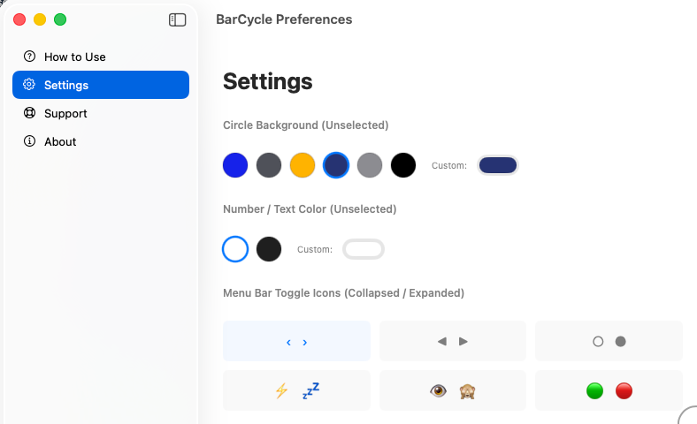
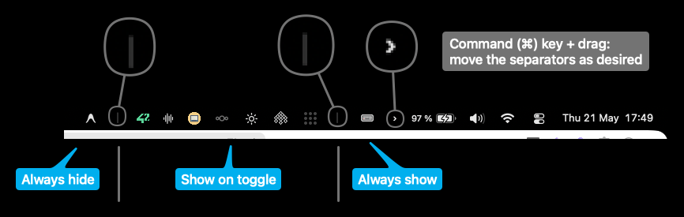
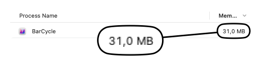

# BarCycle

> Alt-tab for the menu bar.


## Why this app

Other solutions either force you to:
- hide items: **less clutter** but **more struggle** to access
- keep items visible: **less struggle** to access but **more clutter**

With **BarCycle**, you keep items hidden but quicly accessible via ⌥ + tab:
- **hit** the shortcut
- **cycle** to your item (or input its index)
- **interact** with it
- it **hides** automatically

## Features

- Keyboard-first item cycling
- 3 item zones (always hidden/collapsed/visible)
- Minimal memory (30mb only)
- Minimal customization

## Screenshots

The  ⌥ + tab shortcut in action:


The settings for a bit of customization:



How to configure your items by zones (same as hiddenbar/ice...):



Average memory consumption:



## Installation 

- Download latest dmg file from release
- Drag and drop the app into your applications folder
- Open the app

## Usage

1. Launch the app.
2. Configure your items by zones (see tutorial in the settings)
3. Quickly access your items with ⌥ + tab


## Build from source

```bash
./build.sh
open ./BarCycle.app
```

## Project Structure

- `BarCycleApp.swift` - app entry point
- `HUDWindow.swift` - HUD presentation
- `WindowScanner.swift` - window discovery
- `SettingsWindow.swift` - preferences UI
- `build.sh` - build helper

## Contributing

1. Fork the repository.
2. Create a branch for your change.
3. Run the project locally.
4. Open a pull request with a clear description.

## License

- This project is licensed under the MIT License.
