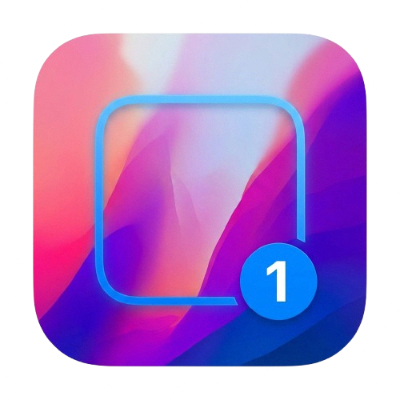

# BarCycle



BarCycle is a small macOS utility that helps power users quickly hide, restore, and cycle through application windows using a compact HUD. It is useful when you have many windows open and want a focused, keyboard-friendly way to manage visibility without rearranging windows or switching away from the current workspace.

## Problem it solves

- Reduces visual clutter by letting you hide windows temporarily.
- Lets you quickly cycle through and reveal windows without switching apps.
- Provides a lightweight HUD for fast, transient window management.

## What it does

- Scans open windows and shows a minimal HUD with controls to hide, restore, or cycle windows.
- Offers settings for customizing behavior (see `SettingsWindow.swift`).
- Runs as a small menu- or HUD-style macOS app with minimal UI footprint.

## Key files

- `BarCycleApp.swift` — app entry point
- `HiderModule.swift` — window hide/restore logic
- `HUDWindow.swift` — HUD presentation and interactions
- `WindowScanner.swift` — window discovery and metadata
- `SettingsWindow.swift` — preferences UI
- `Resources/icon.png` — app and DMG artwork
- `build.sh` — convenience build script

## Installation

Prebuilt releases

- Download the latest release from the GitHub Releases page (create a release that includes a zipped `BarCycle.app`).
- Install via Homebrew Cask (recommended for end users) once a cask is published: `brew install --cask your-tap/barcycle`

From source (developer)

1. Open the project in Xcode (if you have an Xcode project) or open the Swift files in an Xcode workspace. If you maintain an Xcode project, use Xcode to build and run.
2. Or use the included build script:

```bash
./build.sh
# After a successful build you'll have BarCycle.app in the repo or in the build output.
open ./BarCycle.app
```

3. To run the built binary directly:

```bash
./BarCycle.app/Contents/MacOS/BarCycle
```

Notes:
- If your setup uses an Xcode project or Swift Package Manager, adapt the commands accordingly (`xcodebuild` or `swift build`).

## Development

- Use Xcode to set breakpoints and run the UI target.
- Check `build.sh` for build specifics used by local agents and CI.

## Publish to Homebrew (Cask)

Common approach for macOS GUI apps is to publish a Homebrew Cask. High-level steps:

1. Create a GitHub release for the app and attach a zipped `BarCycle.app` (or a downloadable URL).
2. Create a Homebrew Tap (GitHub repo `username/homebrew-tap`) or contribute a cask to `homebrew/cask`.
3. Add a cask Ruby file (`barcycle.rb`) to the tap under `Casks/` with contents similar to the sample below.
4. Open a Pull Request to `homebrew/cask` if you want it in the official repository, or publish in your tap and instruct users to `brew install --cask username/tap/barcycle`.

Sample Cask (`Casks/barcycle.rb`):

```ruby
cask "barcycle" do
  version "1.0.0"
  sha256 :no_check

  url "https://github.com/USERNAME/REPO/releases/download/v#{version}/BarCycle.zip"
  name "BarCycle"
  desc "Lightweight window HUD to hide, restore, and cycle windows"
  homepage "https://github.com/USERNAME/REPO"

  app "BarCycle.app"

  zap trash: [
    "~/Library/Preferences/com.example.BarCycle.plist",
  ]
end
```

Publishing notes:
- Use a stable URL (GitHub Releases is recommended).
- For `homebrew/cask` maintainers, follow the Homebrew Cask style guide and CI requirements.
- If you prefer a formula (for a command-line binary) instead of a cask, supply a tar/zip with an executable and use a formula Ruby file.

## Troubleshooting

- If the HUD doesn't appear, check Accessibility permissions in System Settings → Privacy & Security → Accessibility.
- If windows can't be hidden or discovered, make sure the app has the necessary screen/window access and is allowed in Automation/Accessibility.

## License

Add a `LICENSE` file to the repository and update this section accordingly.

## Next steps & suggestions

- Create a properly signed release build and attach zipped `BarCycle.app` to GitHub Releases.
- Provide a 1024×1024 icon and exported ICNS for the app bundle.
- Create a Homebrew Tap or submit the sample cask to `homebrew/cask` to make installation easy for users.

---

If you want, I can also generate the sample Homebrew Tap PR steps and a ready-to-submit `barcycle.rb` cask with exact URLs once you provide the release URL and version.
